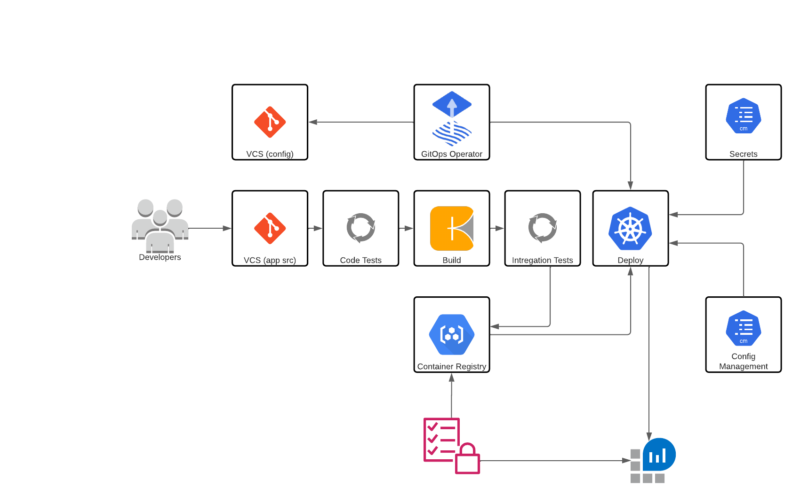

# High Level Architecture

[Click this link for the tooling and process decision matrix](Decision_Table.MD)

## Application Architecture

[Application Architecture](Application_Architecture.md)

## Repository

[GitLab Architecture](GitLab_Setup.md)

## Code Testing

[Testing process](Testing_Process.md)

## Build tooling / process

[Build Tooling](Build_Tooling.md)

## Integration Testing

[Testing process](Testing_Process.md)

## Deployment
[GitLab Architecture](GitLab_Setup.md)

## Container Registry

[Container Registry](Container_Regsitry.md)

## GitOps tooling / process

[Gitops Tooling](Gitops_Tooling.md)

## Secret management

[Secrets Management](Secrets_Management.md)

## Logging and monitoring

[Logging and Monitoring](Logging_Monitoring.md)

## Security

[Security Architecture](Security_Architecture.md)

